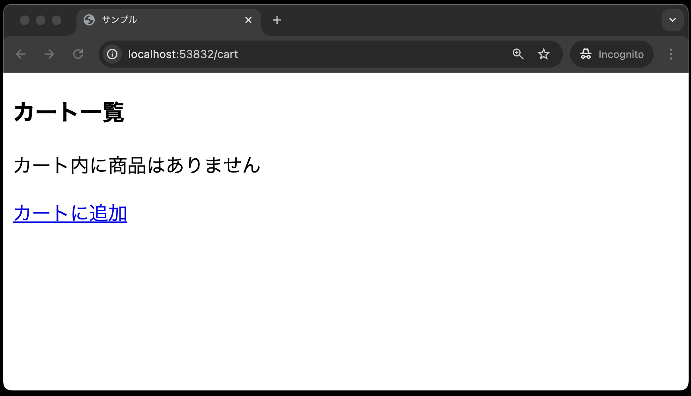
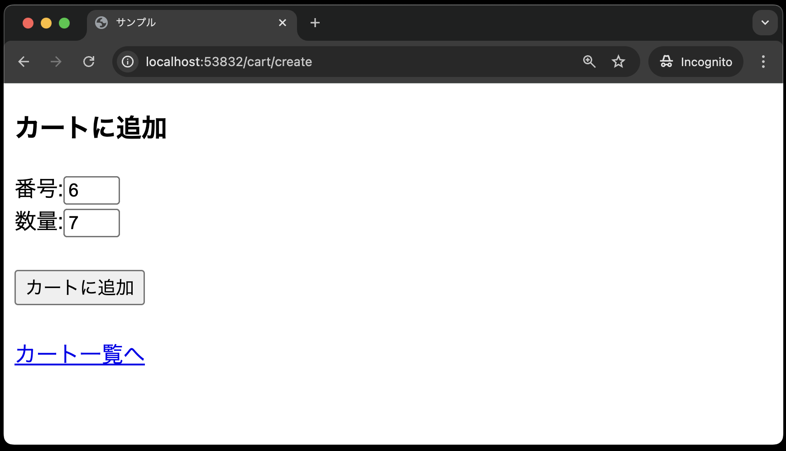
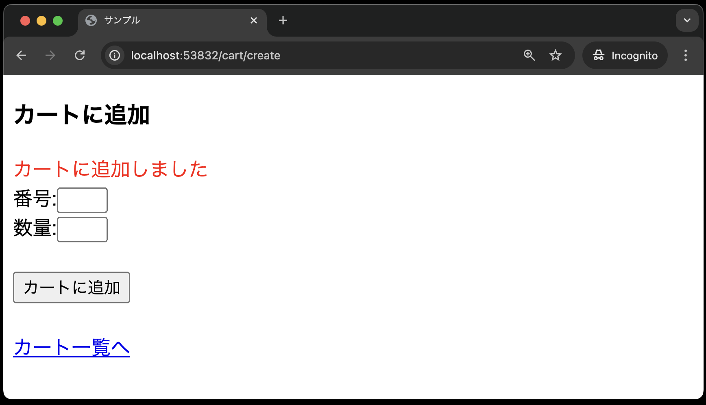
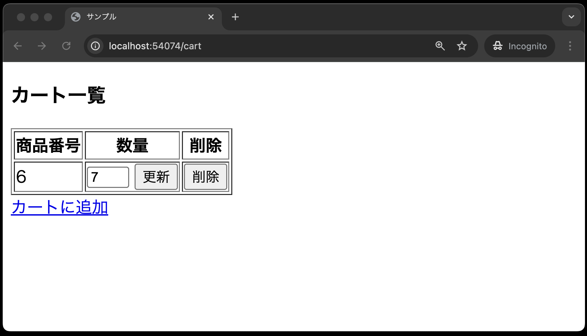
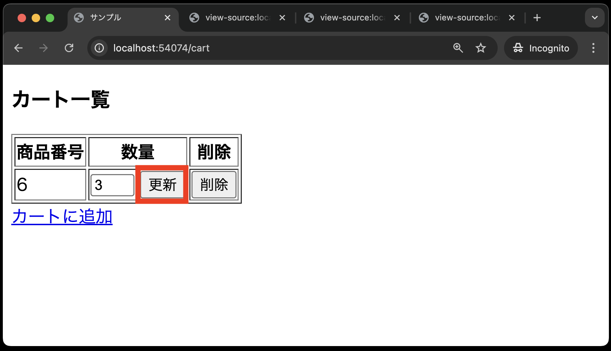
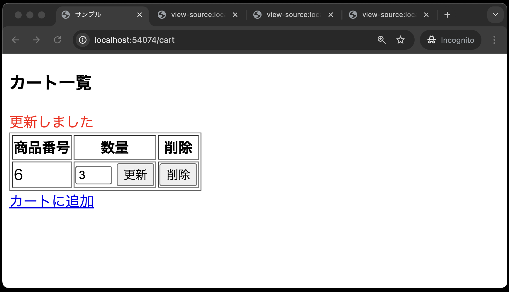
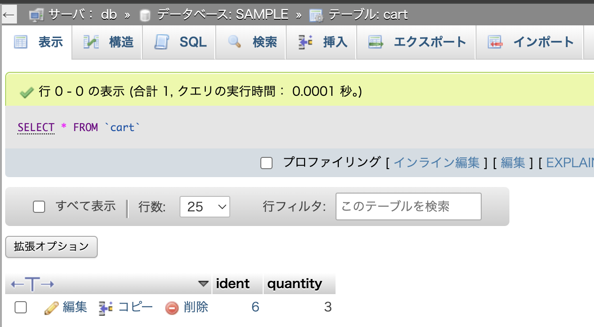

# カートの更新機能を実装

次に、カートの注文数を変更する機能を実装します。

## ルーティングの設定

`routes/web.php`に以下のルーティングを追加します。

```php
<?php

use Illuminate\Support\Facades\Route;
use App\Http\Controllers\ItemController;
use App\Http\Controllers\CartController;

// 途中省略

Route::get('cart', [CartController::class, 'index'])->name('cart.index');
Route::delete('cart/{cart}',[CartController::class, 'destroy'])->name('cart.destroy');
// --- 以下を追加 ---
Route::patch('cart/{cart}',[CartController::class, 'update'])->name('cart.update');
```

**【解説】**

`Route::patch('cart/{cart}',[CartController::class, 'update'])->name('cart.update');`: <br>
カートの注文数を変更するためのルーティングです。
`CartController`の`update`メソッドを呼び出します。
`Route::patch`メソッドを使って、HTTPメソッドが`PATCH`リクエストを受け付けるように設定しています。

今回は、カート内の商品の注文数を変更するため、`PATCH`メソッドを使います。
`PATCH`メソッドは、リソースの一部を更新するためのメソッドです。

## ビューの修正(更新ボタンの追加)

`resources/views/cart/index.blade.php`を以下のように修正します。


```php
<!DOCTYPE html>
<html lang="ja">
<head>
<meta charset="UTF-8">
<meta name="viewport" content="width=device-width, initial-scale=1.0">
<title>サンプル</title>
</head>
<body>
    <h3>カート一覧</h3>
    @if (session('message'))
        <font color="red">{{ session('message') }}</font>
    @endif
    @if( count($carts) == 0 )
        <p>カート内に商品はありません</p>
    @else
        <table border="1">
        <tr>
            <th>商品番号</th>
            <th>数量</th>
            <th>削除</th>
        </tr>
        @foreach( $carts  as  $cart )
            <tr>
                <td> {{ $cart->ident }} </td>
                <!-- 以前のコードはコメントアウト -->
                <!-- <td> {{ $cart->quantity }} </td> -->
                <!-- 以下を追加 -->
                <td>
                    <form method="POST" action="{{ route('cart.update', ['cart' => $cart->ident]) }}">
                        @csrf
                        @method('PATCH')
                        <input type="number" name="quantity" value="{{ $cart->quantity }}" min="1" max="10">
                        <input type="submit" value="更新">
                    </form>
                </td>
                <!-- ここまで -->
                <td>
                    <form method="POST" action="{{ route('cart.destroy', ['cart' => $cart->ident]) }}">
                        @csrf
                        @method('DELETE')
                        <input type="submit" value="削除">
                    </form>
                </td>
            </tr>
        @endforeach
        </table>
    @endif
    <a href="{{ route('cart.create') }}">カートに追加</a>
</body>
</html>
```

**【解説】**

`<form method="POST" action="{{ route('cart.update', ['cart' => $cart->ident]) }}">`: <br>
注文数を変更するためのフォームです。
`route`関数の第2引数に`['cart' => $cart->ident]`を指定しています。
これにより、`$cart->ident`の値が、ルーティングの`{cart}`に代入されます。

`@method('PATCH')`: <br>
`PATCH`リクエストを使うことを指定しています。
`GET`リクエストや`POST`リクエストを使う場合は特に指定しなかったのに対し、`PATCH`メソッドを使う場合は明示的に指定する必要があります。
なぜなら、ブラウザは`PATCH`リクエストをサポートしていないためです。
そのため、`@method('PATCH')`を使って、`PATCH`リクエストを使うことを明示的に指定しています。
これにより、ルーティングを見るだけで、更新機能があることがわかります。



## コントローラの修正(`update`メソッドの追加)

`app/Http/Controllers/CartController.php`を以下のように修正します。

```php
<?php
namespace App\Http\Controllers;

use Illuminate\Http\Request;
use App\Models\Cart;

class CartController extends Controller
{
    // 途中省略

    public function destroy(Cart $cart)
    {
        $cart->delete();
        return redirect()->route('cart.index');
    }

    // --- 以下を追加 ---
    public function update(Request $request, Cart $cart)
    {
        $validated = $request->validate([
            'quantity' => 'required|integer|min:1|max:10',
        ]);
        $cart->update(['quantity' => $validated['quantity']]);
        $request->session()->flash('message', '更新しました');
        return redirect()->route('cart.index');
    }
    // --- ここまで ---
}
```

**【解説】**

`public function update(Request $request, Cart $cart)`: <br>
カート内の商品の注文数を変更するためのメソッドです。
Laravelでは、コントローラのメソッドにupdateと命名する場合、更新処理を行うことが一般的です。

`$cart->update(['quantity' => $request->quantity]);`: <br>
`$cart`の`update`メソッドを使って、レコードを更新しています。
`$request->quantity`の値で、`$cart`の`quantity`カラムを更新しています。
これにより、指定したレコードの注文数が変更されます。

カート内の商品の注文数を変更する機能が実装できました。

## 動作確認(2回目:更新機能)

以下の手順で動作確認をしてみましょう。

1. `http://localhost:{ポート番号}/cart`でカート一覧画面にアクセスする<br>
   
2. カート追加画面にアクセスする<br>
   
3. 商品番号と数量を入力し、カートに追加する<br>
   
4. カート一覧画面に遷移し、商品が追加されていることを確認する<br>
   
5. 注文数を変更し、更新ボタンを押す<br>
   
6. カート一覧画面に遷移し、商品の注文数が変更されていることを確認する<br>
   
7. phpMyAdminでもデータの整合性を確認できたらOK<br>
   
